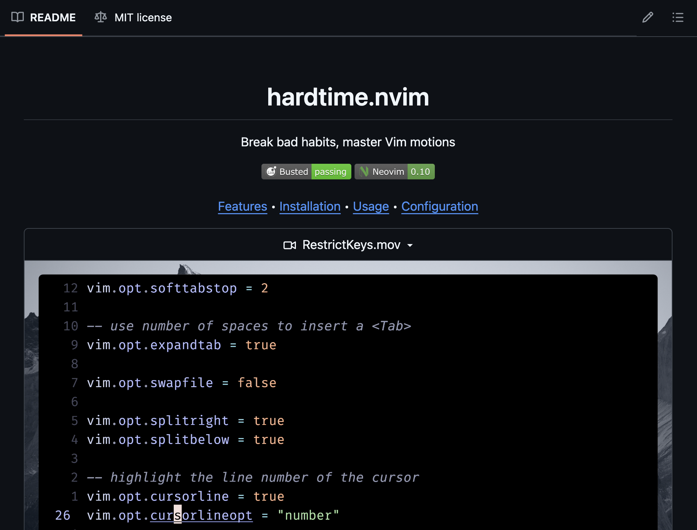
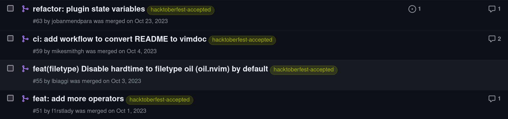
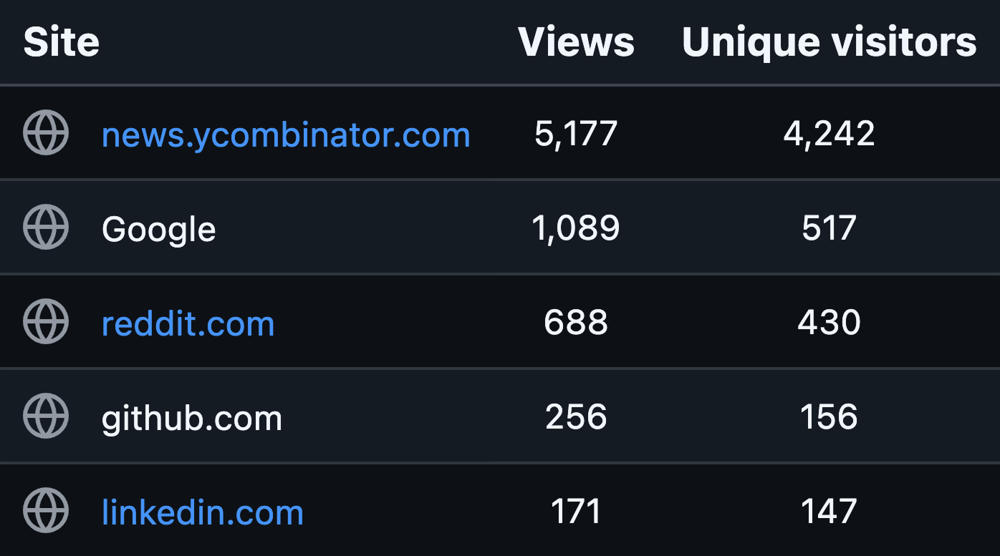

Recently, my Neovim plugin: [hardtime.nvim](https://github.com/m4xshen/hardtime.nvim) reached 2k stars on GitHub!

I think it's a good time to share what I have learned from promoting my open-source project. I break down the process into three stages: preparation, promotion, and maintenance.

## Preparation

Before promoting your project, make sure it's ready for the public. Here are some things you should prepare:

### 1. README

README is the first thing people see when they visit your project. Make sure it's clear and concise. At a minimum, it should include:

- Short tagline or description of the project
- Demo video or screenshot
- Features of this project
- Installation guide
- Usage guide

The first two are the most important. They make people quickly understand what your project is about and how it looks like so that they are more likely to continue reading the rest of the README. Here's an example from my project:

For the rest of the README, it might be difficult to write a good one from scratch. Don't worry! You can look at other popular projects in the same domain to get inspiration. Learning from other's success is a good way to improve your project.

### 2. Contribution guide

If you want people to contribute to your project, you need to provide a contribution guide, which should include:

- How to set up the development environment
- The coding style of this project
- The format of the commit message
- What issues are good for beginners

### 3. Issue template

When people start using your project, they might encounter bugs or have feature requests. To make it easier for them to report issues, you should provide an issue template.

You can create an issue template by following [this GitHub docs](https://docs.github.com/en/communities/using-templates-to-encourage-useful-issues-and-pull-requests/configuring-issue-templates-for-your-repository).

This ensures users provide enough information for you to reproduce the issue and fix it, which makes your later maintenance work easier.

## Promotion

After preparing your project, it's time to share it! Here are some strategies you can use:

### 1. Share with the community

You can share your project on the platform where your target community is active. Most of the time, I would recommend sharing it on Reddit and HackerNews. These two platforms are great for reaching out to developers and getting feedback.

In my case, Neovim community is pretty active on Reddit, so I shared my project on the [r/neovim](https://www.reddit.com/r/neovim/):

<blockquote class="reddit-embed-bq" style="height:500px" data-embed-theme="dark" data-embed-showedits="false" data-embed-created="2024-06-07T07:16:09.555Z" data-embed-height="566"><a href="https://www.reddit.com/r/neovim/comments/14jferq/hardtimenvim_a_neovim_plugin_helping_you/">hardtime.nvim - A Neovim plugin helping you establish good command workflow and habit</a>  by<a href="https://www.reddit.com/user/m4xshen/">u/m4xshen</a> in<a href="https://www.reddit.com/r/neovim/">neovim</a></blockquote>

Here are 3 things I always do when sharing project on Reddit:

- Post with video or image. People are more likely to click on a post like this than a plain text post.
- Post at the user-active time. I use website like [SocialRise](https://social-rise.com/subreddit-analysis) to search the best post time of a specific subreddit.
- Remember to explain the detail of your project and link to the GitHub repo.

<blockquote class="reddit-embed-bq" data-embed-theme="dark" data-embed-showedits="false" data-embed-created="2024-06-07T07:20:08.959Z" data-embed-height="641"><a href="https://www.reddit.com/r/neovim/comments/14jferq/comment/jpkuvyz/">Comment</a>  by<a href="https://www.reddit.com/user/m4xshen/">u/m4xshen</a> from discussion<a href="https://www.reddit.com/r/neovim/comments/14jferq/hardtimenvim_a_neovim_plugin_helping_you/"><no value=""></no></a>  in<a href="https://www.reddit.com/r/neovim/">neovim</a></blockquote>

Also remember to engage with the community. If someone asks a question or gives feedback no matter it's positive or negative, make sure to respond to them. This shows that you care about the users and are willing to improve the project.

### 2. Write articles

Don't get me wrong. I don't mean you have to write a post about your project. Often, people are not interested in reading a post that is just a promotion of a project. Instead, you can write articles related to the problem your project solves and mention your project in the article.

For example, here are my 2 articles related to the Vim command:

- [Practical Vim command workflow](/posts/vim-command-workflow)
- [You might be overusing Vim visual mode](/posts/overuse-vim-visual-mode)

At the end of both articles, I mention hardtime.nvim as a tool to help establish good command workflow and quit bad habits.

In this way, since you provide value to the readers, they will more likely to take a look at your project.

### 3. Hacktoberfest

Apart from actively promoting your project, you can also leverage events like [Hacktoberfest](https://hacktoberfest.com) to attract contributors. Hacktoberfest is an annual event that encourages people to contribute to open source throughout October.

By tagging your project with `hacktoberfest` and providing issues that are good for beginners, you can attract more contributors to your project. Here is an example of the pull requests I received during Hacktoberfest:

## Maintenance

Building an open-source project is not a one-time thing. You need to maintain it to keep it alive. User feedback, bug reports, and feature requests will keep coming in, and you need to handle them properly.

Using issue labels can help you organize the issues. For example, you can use `bug`, `enhancement`, `good first issue`, etc., to categorize the issues. This makes it easier for you to prioritize and work on them.

After a while, your project might develop more features or even release a major version. You can then get back to the promotion stage and share the updates with the community.

For example, after my first post about hardtime.nvim, I worked on the users' feedback and added some new features. I then wrote a new post few months later to share the updates:

<blockquote class="reddit-embed-bq" style="height:500px" data-embed-theme="dark" data-embed-showedits="false" data-embed-created="2024-06-07T08:43:29.307Z" data-embed-height="546"><a href="https://www.reddit.com/r/neovim/comments/15wapw7/update_hardtimenvim_more_hints_custom_hints/">UPDATE: hardtime.nvim - more hints, custom hints, hardtime report</a>  by<a href="https://www.reddit.com/user/m4xshen/">u/m4xshen</a> in<a href="https://www.reddit.com/r/neovim/">neovim</a></blockquote>

Just make sure the update are valuable to the users. You don't want to spam the community with minor updates that don't bring much value.

Another example is that recently I fixed some long-standing issues, and released its first major version v1.0.0. I then shared it on Reddit again:

<blockquote class="reddit-embed-bq" style="height:500px" data-embed-theme="dark" data-embed-height="574"><a href="https://www.reddit.com/r/neovim/comments/1kpifoi/hardtimenvim_v100_is_now_released/">Hardtime.nvim v1.0.0 is Now Released!</a>  by<a href="https://www.reddit.com/user/m4xshen/">u/m4xshen</a> in<a href="https://www.reddit.com/r/neovim/">neovim</a></blockquote>

This time, I also shared the update on HackerNews. It is a minimalist platform where you can only post a link and a short title. So make sure to write a eye-catching title that describes your project well:

[Show HN: Hardtime.nvim – break bad habits and master Vim motions](https://news.ycombinator.com/item?id=44020734)

I would say that HackerNews is harder to get attention than Reddit since all different kinds of projects are mixed together. But if you can get to the front page, it will bring A LOT of traffic to your project.

Here's the GitHub traffic chart I got few days after posting on Reddit and HackerNews. You can see that the traffic from HackerNews is much higher than other platforms:

## Conclusion

That's pretty much it! I hope you find these tips helpful for promoting your open-source project. Remember, building an open-source project is not just about writing code. A good project is useless if no one knows about it. So don't be shy, share your project with the world!
